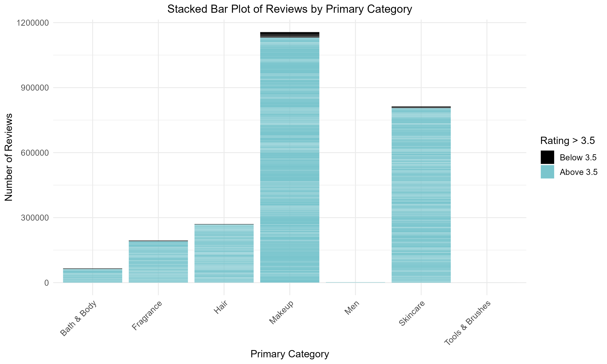
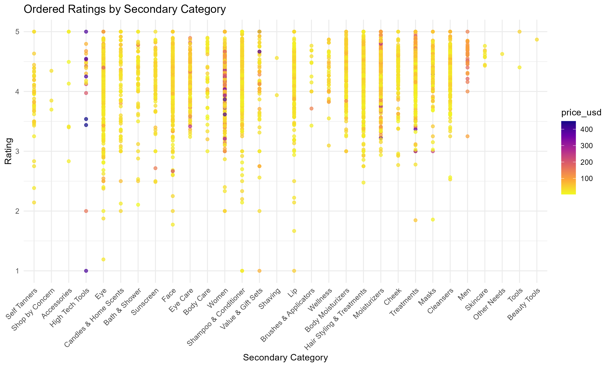
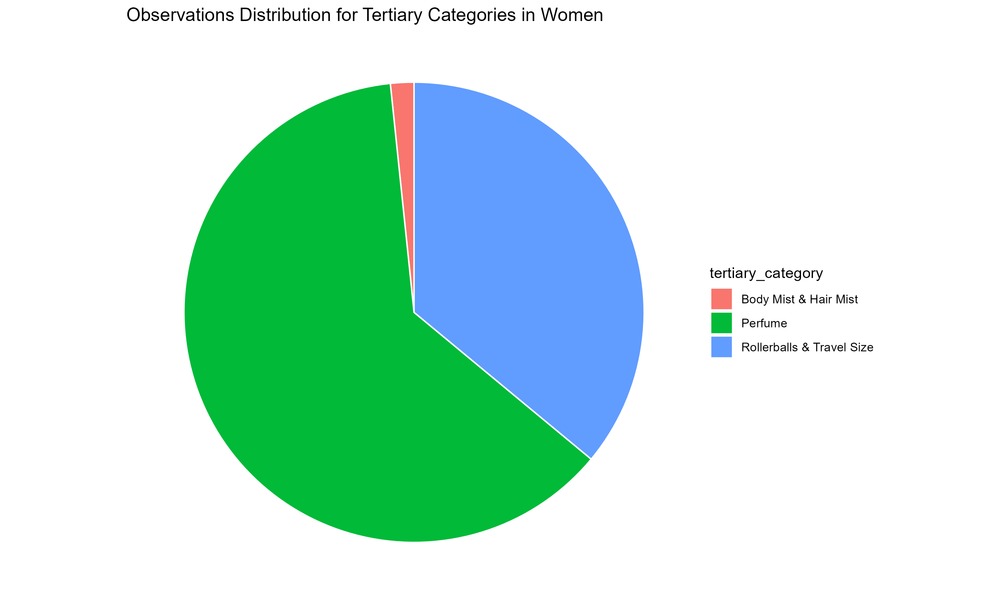
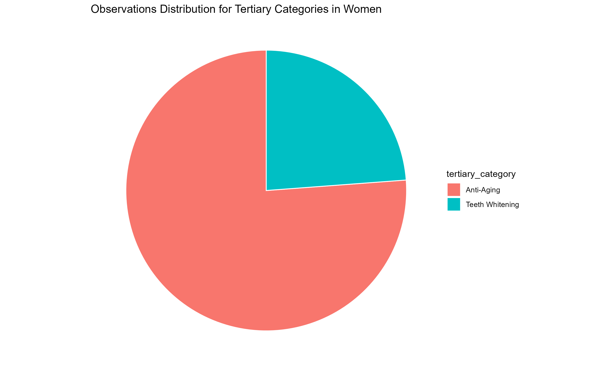
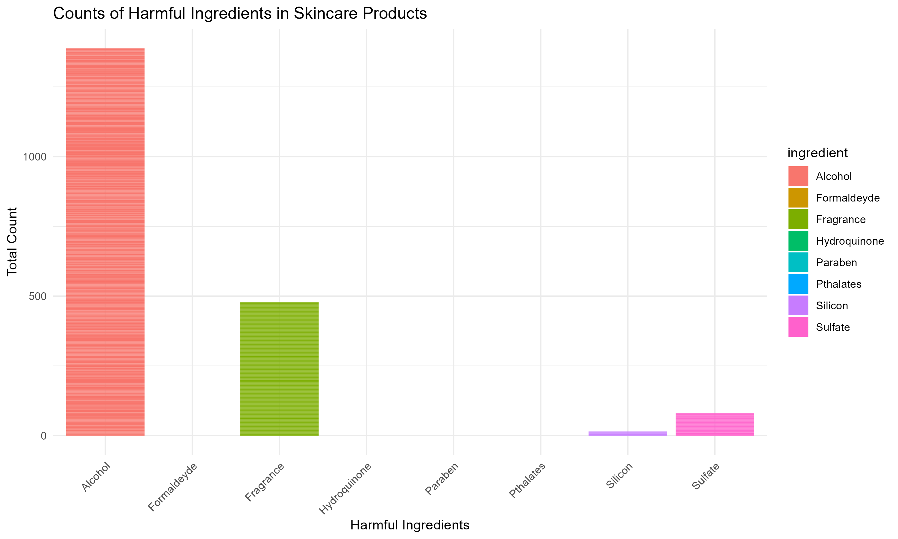
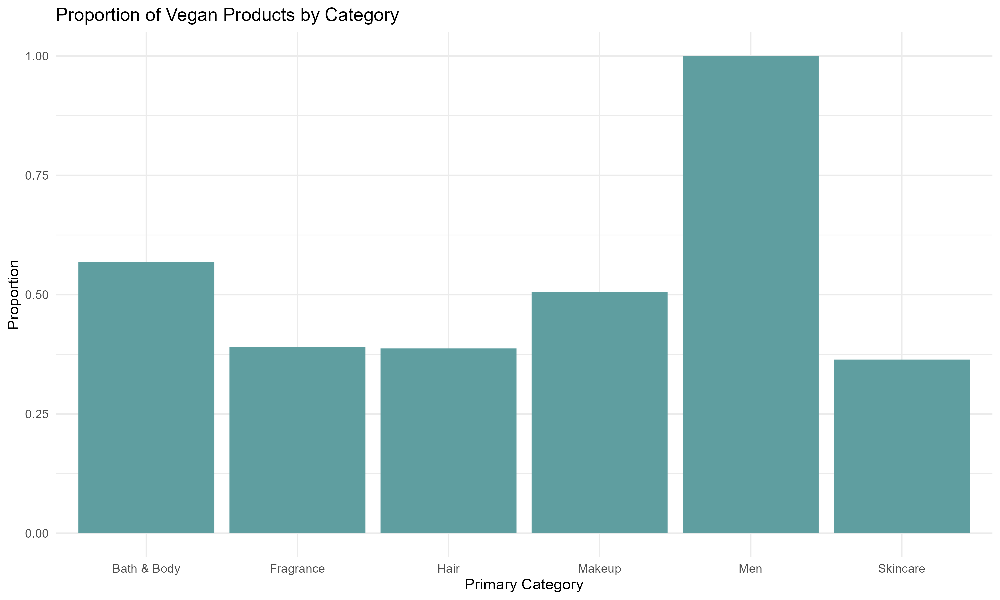

## Introduction

Through this project I want to delve deep into consumer insights and analysis by looking at the response that products get on Sephora's online website. The data included all sorts of ways people can engage with the products, either by selecting the 'love' button, or dropping a review or giving it a rating on a scale of 5. It also includes segregation based on primary, secondary and tertiary category. It gives an insight about the ingredients in the products and finally the prices of the products.

### Aim of the Study

-   Assess the categories listed on Sephora and compare their performances using the numerical variables like loves count, ratings and so on.

-   Examine trends and uncover less obvious patterns in consumer engagement on the website.

-   Identify the extent of prevalence of parabens, silicates and other harmful ingredients in skincare products. Evaluate presence and performance of vegan products in the market.

### Analysis

#### [Comparison across various Categories]{.underline}

The primary category division gives us a clear view of what sort of products' sales does Sephora dominate in. We do this by plotting the number of reviews in each of the category and then assessing the average ratings that the same reviews give.

-   People who buy makeup always come back and drop a review as depicted in the graph. The skincare category comes to close a second. It is safe to assume that these two categories play an essential role in people's life and therefore consumers feel the need to warn everyone about whether the product worked or not

-   Interesting thing to note here is that the ratings are always on a higher end, Hardly are there any ratings above 3.5 which ironically makes us doubt whether the reviewers are genuine or not. Due to social media reach, many a times influencers with a lot of followers are paid to publish ingenuine reviews and so are thousands of people who will readily submit reviews for a small price.

The secondary category further divides the products allowing a better understanding of the specific department a product a belongs to and their ratings. This time we also check the price points of each of these categories.

-   Again, we seem to notice that most of the ratings lie above 3.

-   The colour depicts how expensive the products are, darker beimg more expensive.

-   Two categories stand out to have the most expensive products: Women and High Tech Tools. It is absurd to find that most of the categories are women oriented, but why would there be a specific women department? We will use a pie chart to identify the tertiary categories of the products that fall under this category.

-   According to the graph, this category would be better named as Perfumes and fragrances.

-   Now it perfectly makes sense why it would have a higher price range than others. Most luxury brands launch perfumes as their first beauty product before entering the cosmetic market since perfumes don't need any of the extensive testing/side-effects study that cosmetics need.

-   Next we observe the products that come under high tech tools.

-   Two categories dominate in this case: tooth-whitening tools and anti aging tool.

-   When we look into what products actually are sold under this category, we find out that it is the advanced LED face masks that give out a particular red light known to be good for ant aging properties. The other tool is electric brushes and and whitening kits that have elaborate procedures that result to a whiter looking teeth.

[Breaking down the constituents of Skincare Products]{.underline}

Let us now dig into the product ingredients and check how safe they are on our skin.

-   Numerous studies highlight the potential harm of skincare ingredients like parabens and silicates, known for disrupting endocrine function and causing skin irritation. Despite these findings, many skincare products still include these substances, underscoring the need for increased consumer awareness and industry scrutiny for safer formulations

-   In the following graph, I have selected a range of ingredients that are proven to be not-skin friendly. We now check their presence in the Sephora's products:

-   As we can clearly see, the most common ingredient seems to be alcohol. Scientists believe that alcohol is an extremely drying substance, that rips the skins natural moisture and oil, thus enhances sebum creation that is the leading cause for breakouts.

-   Fragrances are a close second and although they are sometimes used to mask bad smelling but important ingredients in skincare, the artificial kinds are actually quite terrible for the skin. One way to avoid this is using naturally occuring fragrances like flowers, cinnamon and so on.

-   A useful information that was found in this dataset was the highlights column that gave keywords about the product to describe it precisely. One of the indications it had was whether the product was vegan.

-   While playing around with the filtered data that contained only vegan products, an interesting observation was found. When we check the proportion of vegan products across all primary categories, the 'men' category displayed 100% proportion.

This also seems a bit absurd knowing that all of the men's products are in fact vegan.

There can be two explanations to this:

-   The data does not capture all the men's products, and the ones in the data just happen to be vegan.

-   These specific products were categorized into men since they did not belong in any other category. They could all belong to the same brand that produces vegan products only. Rest of the men's products were inlcuded in other categories as required.

## Limitations of the Dataset

The data set allows you to analyse the response a product gets, but the real information would lie in the actual review since the ratings were usually around 4 or 5 (very high). Doing an NLP on the review data might get us more insights about the how consumers feel about the product.

The main issue was the difficult in analysing the demand We did not have information about how many of these products are sold.

Applying any kind of regression would need logical variables that depict some sort of behavior corresponding to the variable under study. Hence, as much as I wanted to fit some sort of a model, I could not find a legitimate reason as to explain why I chose a so and so variable in the model.
